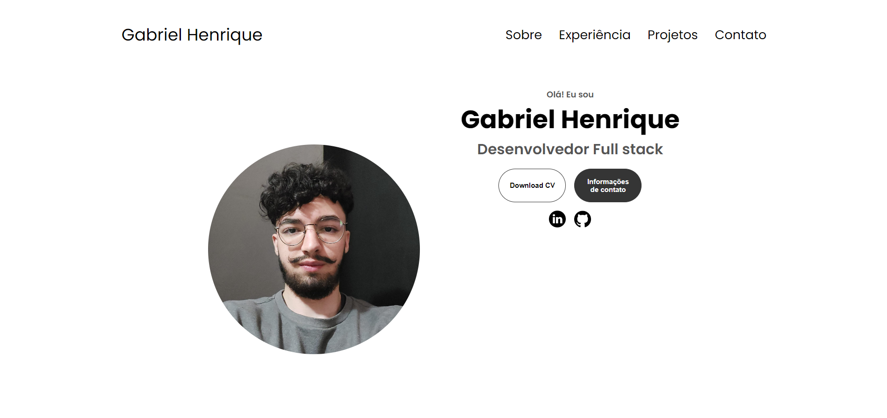

 # Portifólio minimalista 

 

 - Protifólio minimalista e responsivo, com uma estrutura organizada e intuitiva, oferece uma navegação fluida através de diferentes seções

 - Projeto construído durante o curso PROPROFISSÃO.

 [Clique aqui para acessar!](https://gabrielaguiar1573.github.io/portifolioMinimalista/)

## Tecnologias

- HTML
- CSS
- Git e Github

## Contato

gabrielhenriquedeaguiar@gmail.com
